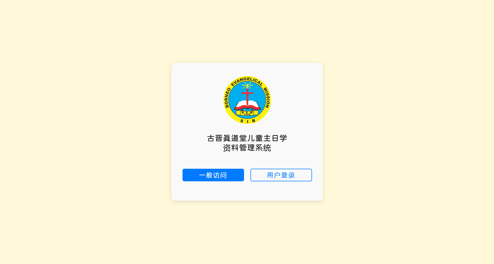
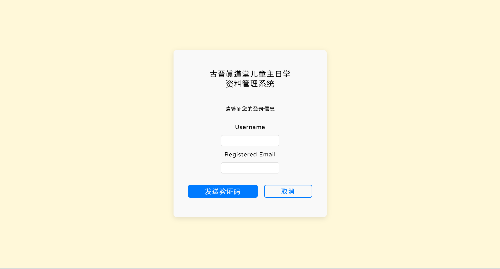
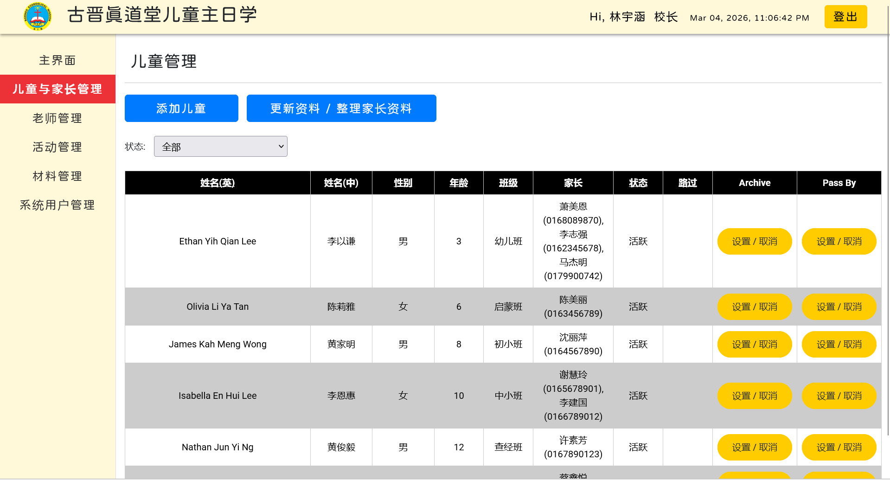
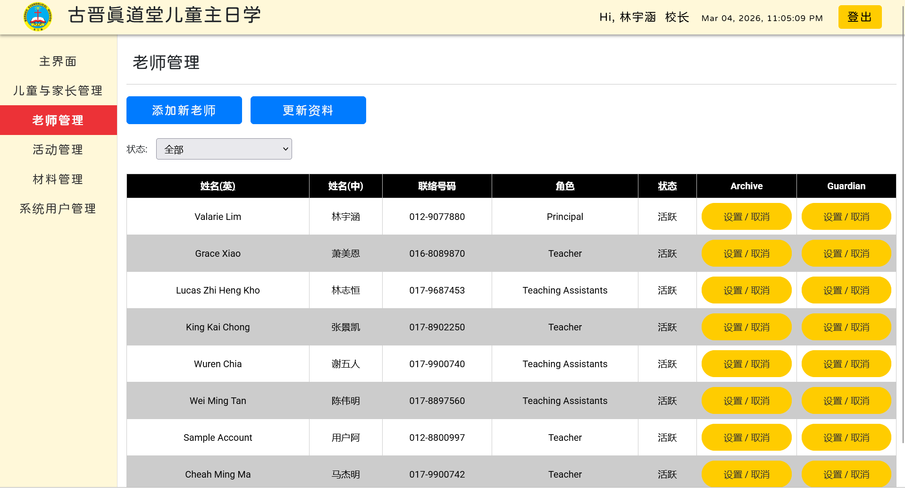
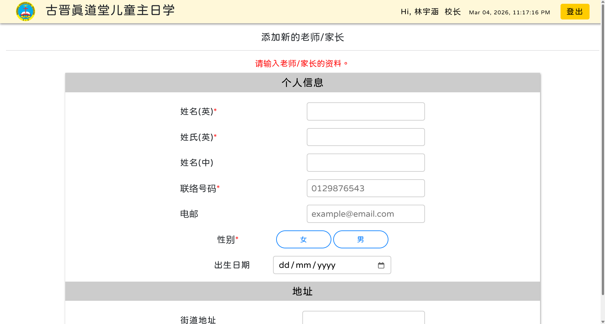

# Sunday School Management System

ASP.NET Web Application | SQL Server | PDF Reporting | SMTP Email | Cloud Deployment | HTTPS Security

A web-based management system developed as a capstone project for the Diploma in Information Technology programme.  
The system helps Sunday School administrators and teachers manage attendance records, children information, and activity schedules through a centralized database-driven platform.

Live Demo  
https://bem-sun-sch.runasp.net

---

## System Preview

---

## Key Technical Highlights
- Full-stack web application built with **ASP.NET** Web Forms
- Secure authentication system with **password hashing and salting**
- **Login attempt limit** to prevent brute-force attacks
- **Role-based access control** (Principal / Admin / General Teacher)
- Filterable report generation with **PDF export**
- Email notification integration using **Brevo SMTP**
- Cloud deployment with **HTTPS and SSL** security
- Centralized SQL Server database system

---

## Project Overview
This project aims to replace the current manual data management approach using Microsoft Excel with a centralized Database Management System (DBMS).

The objectives of this project are:
1. To deploy a user-friendly and centralized DBMS for real use by Sunday School principals and teachers.
2. To simplify the data entry process and automate report generation.
3. To improve data management efficiency, increase record accuracy, and enhance data security.

Currently, the Sunday School manages operational data using Microsoft Excel.  
This system introduces a structured database-driven platform to improve efficiency and reliability.

---

## System Purpose
The system provides a centralized platform for Sunday School administrators and teachers to manage operational records.

Key purposes include:
- Recording children attendance
- Managing children, guardians, and teacher information
- Organizing Sunday School activities and teaching schedules
- Generating attendance and schedule reports
- Maintaining a centralized and secure database

---

## System Modules
The system consists of several modules designed to support daily Sunday School operations.

Main modules include:
- Authentication system
- Children information management
- Guardian information management
- Teacher information management
- Attendance recording system
- Activity and teaching schedule management
- PDF reporting system
- Administrative dashboard

---

## System Features
- Role-based login system (Principal / Admin / General Teacher)
- Children attendance recording system
- Activity and teaching schedule management system
- Filterable attendance report export to PDF
- Filterable teaching schedule export to PDF
- Admin dashboard for centralized management
- Children, guardian, and teacher information management
- Email notification system using Brevo SMTP
- Database-driven system

---

## Reporting Features
The system includes a built-in reporting module that allows administrators and teachers to generate printable reports.
Users can filter records based on selected conditions before exporting the report to **PDF format**.

Supported reports include:
- Attendance reports
- Teaching schedule reports

This feature simplifies documentation and allows quick sharing or printing of official records.

---

## Security Features
The system implements several security mechanisms to protect user accounts and system data.

Security features include:
- Password hashing with salted hash
- Login attempt limit to prevent brute-force attacks
- Role-based access control (Principal / Admin / General Teacher)
- Secure authentication system
- HTTPS encrypted communication
- SSL-secured domain access

---

## Email Notification
The system integrates **Brevo SMTP email service** for automated email communication.
Email functionality is implemented using the `System.Net.Mail` namespace in ASP.NET.
This allows the system to send automated notifications and system messages when required.

---

## System Design Overview
The system follows a typical **three-layer web application architecture**.

### Frontend
Responsible for user interface and interaction.
- HTML
- CSS
- JavaScript

### Backend
Handles application logic, authentication, and system operations.
- ASP.NET Web Forms
- VB.NET

### Database
Responsible for structured data storage and retrieval.
- SQL Server

---

## Cloud Deployment
The system is deployed to a live cloud hosting environment using **MonsterASP.NET**, allowing the application to be accessed through the internet.

Deployment features include:
- ASP.NET web application hosting
- SQL Server database hosting
- HTTPS routing
- SSL-secured domain access
- Live production environment testing

Live system  
https://bem-sun-sch.runasp.net

---

## System Scale
The system consists of **33 web pages** including the homepage, covering multiple management and reporting modules required for Sunday School operations.

---

## Technologies Used
- ASP.NET Web Forms
- VB.NET
- SQL Server
- HTML
- CSS
- JavaScript
- Brevo SMTP (Email Service)
- iTextSharp (PDF Report Generation)
- MonsterASP.NET (Cloud Hosting)
- HTTPS / SSL Security

---

## What I Learned
Through this project, I gained practical experience in:

- Designing relational databases
- Developing web applications using ASP.NET Web Forms
- Integrating frontend and backend logic
- Implementing form validation and database operations
- Implementing email services using SMTP
- Generating dynamic PDF reports
- Deploying web applications to cloud hosting
- Building a full-stack web application independently

---

## Future Improvements
Potential improvements for future development:
- Role-based permission management
- Mobile responsive UI design
- Advanced reporting and analytics
- Enhanced security features

---

## Author
Valarie Lim  
Diploma in Information Technology
